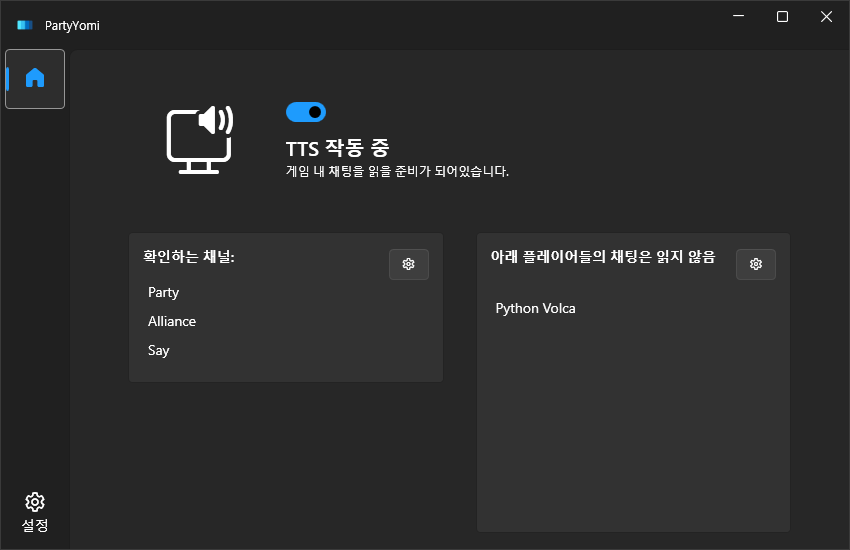
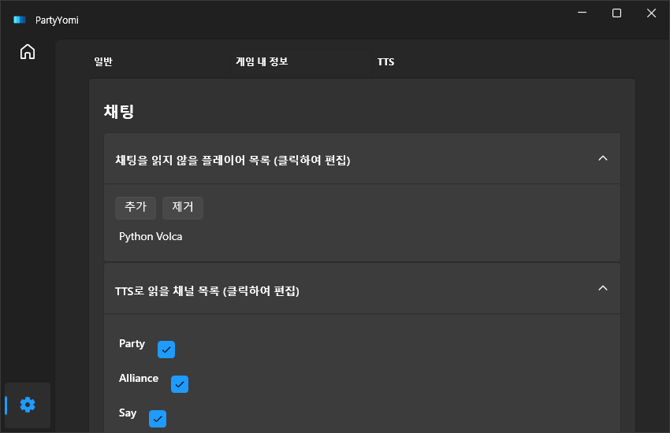

- [PartyYomi](#partyyomi)
  - [Key Features](#key-features)
  - [Requirements](#requirements)

# PartyYomi

TTS program which reads in-game party chat of Final Fantasy XIV

## Supported UI Language

- English (en-US)
- Korean (ko-KR)

## Key Features

* [X] Can choose which chat channel to listen
* [X] Can ignore specific player's chat
* [ ] Change the TTS engine per chat language

## Requirements

* [.NET 8](https://dotnet.microsoft.com/ko-kr/download/dotnet/8.0)
* Windows 10 or above
